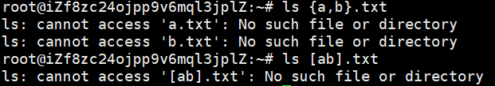

- [拓展](#拓展)
  - [拓展的两种模式](#拓展的两种模式)
- [转义](#转义)
- [引号](#引号)
  - [单引号](#单引号)
  - [双引号](#双引号)
- [变量](#变量)
- [字符串操作](#字符串操作)
  - [字符串长度](#字符串长度)
  - [子字符串](#子字符串)
  - [搜索和替换](#搜索和替换)
      - [字符串头部的模式匹配](#字符串头部的模式匹配)
      - [字符串尾部的模式匹配](#字符串尾部的模式匹配)
      - [任意位置的模式匹配](#任意位置的模式匹配)
  - [改变大小写](#改变大小写)
- [算术运算](#算术运算)
  - [算术表达式](#算术表达式)
  - [数值的进制](#数值的进制)
  - [expr 命令](#expr-命令)
  - [let 命令](#let-命令)
- [行操作（快捷键的使用）](#行操作快捷键的使用)
  - [~~光标移动~~](#光标移动)
  - [~~编辑操作~~](#编辑操作)
  - [自动补全](#自动补全)
  - [操作历史](#操作历史)
  - [~~其他快捷键~~](#其他快捷键)

参考

- [Bash 脚本教程](https://www.ruanyifeng.com/blog/2020/04/bash-tutorial.html)

包含 shell 等词汇的解释（在第一部分）

本文的一级标题与参考文档的目录一一对应

# 拓展

Bash 提供 8 种 拓展 ( globbing )

- `~` 扩展
- `?` 字符扩展
- `*` 字符扩展
- `[]` 扩展
- `{}` 扩展
- 变量扩展
  - `${!sth*}` 扩展成所有以 sth 开头的变量名
- 子命令扩展
  - `$(..)` 可以扩展成另一个命令的运行结果，该命令的所有输出都会作为返回值
- 算术扩展
  - `$((..))` 可以扩展成整数运算的结果，详见《Bash 的算术运算》一章

文件名包括特殊字符时（如 `*`），引用文件名，需要把文件名放在单引号或双引号里面

```bash
$ touch 'fo*'  # 创建名字为 fo* 的文件
```

> Shell 接收到用户输入的命令后，会根据空格将用户的输入拆分成一个个词元（token）  
> 
> Shell 先会扩展词元里面的特殊字符，扩展完成后才会调用相应的命令

## 拓展的两种模式

- 总是拓展
- 匹配失败，原样输出

目录下没有 `a.txt b.txt`



# 转义

> Bash 只有一种数据类型，就是字符串

某些字符在 Bash 里面有特殊含义（比如 `$ & *`）

如果想要原样输出这些特殊字符，就必须在它们前面加上反斜杠，使其变成普通字符

这就叫做 “转义”（escape）

反斜杠除了用于转义，还可以表示一些不可打印的字符

- `\a`：响铃
- `\b`：退格
- `\n`：换行
- `\r`：回车
- `\t`：制表符

```bash
# \ 的另一个用法

$ mv \
/path/to/foo \
/path/to/bar

# 等同于
$ mv /path/to/foo /path/to/bar
```

# 引号

## 单引号

单引号用于保留字符的字面含义，==各种特殊字符==在单引号里面，都会变为普通字符

打印单引号的方法

```
$ echo "it's"
it's
```

## 双引号

双引号比单引号宽松，==大部分特殊字符==在双引号里面，会失去特殊含义，变成普通字符

`` $ `` `` ` ``  `` \ `` 这三个仍然有特殊函数

用法
- 使用反斜杠，在双引号之中插入双引号，或者插入反斜杠
- `$ ls "two words.txt"` 引用有空格的文件名
- `$ echo "this is a     test"` 保留多个空格
- 保存原始命令的输出格式

```bash
# 单行输出
$ echo $(cal)
一月 2020 日 一 二 三 四 五 六 1 2 3 ... 31

# 原始格式输出
$ echo "$(cal)"
      一月 2020
日 一 二 三 四 五 六
          1  2  3  4
 5  6  7  8  9 10 11
12 13 14 15 16 17 18
19 20 21 22 23 24 25
26 27 28 29 30 31
```

# 变量

> Bash 变量分成环境变量和自定义变量两类

- 常见的**环境变量**
- 自定义变量
  - 创建
  - 读取
  - 删除：`unset SOME`
  - 输出：`export SOME='sth'` 
    - 当前 Shell 及随后新建的子 Shell，都可以读取变量 `$SOME`
    - 子 Shell 如果修改继承的变量，不会影响父 Shell  
- 特殊变量
  - 这些变量的值由 Shell 提供，用户不能进行赋值，详见[参考文档：变量]()一节
- 对变量的其他操作
  - 变量的默认值 `${SOME op return}`
  - `declare`
  - `readonly`
  - `let`

# 字符串操作

## 字符串长度

获取字符串长度的语法 `${#varname}`

## 子字符串

字符串提取子串的语法

```
$ varname=frogmanfoot
$ echo ${varname:4:3}
man
```

## 搜索和替换

#### 字符串头部的模式匹配

```bash
# 原始变量不会发生变化

# 如果 pattern 匹配变量 variable 的开头，
# 删除最短匹配（非贪婪匹配）的部分，返回剩余部分
${variable#pattern}

# 如果 pattern 匹配变量 variable 的开头，
# 删除最长匹配（贪婪匹配）的部分，返回剩余部分
${variable##pattern}

# 将头部匹配的部分，替换成其他内容
# 模式必须出现在字符串的开头
${variable/#pattern/string}
```

#### 字符串尾部的模式匹配

```bash
# 对称于上面的用法
${variable%pattern}

${variable%%pattern}

${variable/%pattern/string}
```

#### 任意位置的模式匹配

```bash
# 最长匹配的那部分被 string 替换，但仅替换第一个匹配
${variable/pattern/string}

# 最长匹配的那部分被 string 替换，所有匹配都替换
${variable//pattern/string}

# 模式部分可以使用通配符
```

## 改变大小写

```bash
# 转为大写
${varname^^}

# 转为小写
${varname,,}
```

# 算术运算

## 算术表达式

`((...))`

如果要读取结果，前面加上美元符号 `$`

支持的操作符

- 算术运算
- 位运算
- 逻辑运算
- 赋值运算
  - `$((a=1))`
  - 上面例子中，`a=1` 对变量 a 进行赋值
  - 这个式子本身也是一个表达式，返回值就是等号右边的值

## 数值的进制

- `number`：没有任何特殊表示法的数字是十进制数
- `0number`：八进制数
- `0xnumber`：十六进制数
- `base#number`：base 进制的数

## expr 命令

`expr` 命令支持**算术运算**

## let 命令

`let` 命令用于将**算术运算**的结果，赋予一个变量

# 行操作（快捷键的使用）

Bash 内置了 Readline 库，具有这个库提供的很多 “行操作” 功能

- 默认采用 Emacs 快捷键，下文都是 Emacs 风格的快捷键
- 还支持 Vim 风格

```bash
$ set -o vi     # 改成 Vi 快捷键
```

可以在主目录中的 `~/.bashrc` 文件底部添加下面的行来持久设置它 `set -o vi`

## ~~光标移动~~
- `Ctrl + b`：向行首移动一个字符，与左箭头作用相同
- `Ctrl + f`：向行尾移动一个字符，与右箭头作用相同
- `Alt + b`：移动到当前单词的词首
- `Alt + f`：移动到当前单词的词尾
- `Ctrl + a`：移到行首
- `Ctrl + e`：移到行尾

上面快捷键的 Alt 键，也可以用 ESC 键代替

## ~~编辑操作~~

下面的快捷键可以编辑命令行内容。

- `Ctrl + d`：删除光标位置的字符（delete）
- `Ctrl + w`：删除光标前面的单词
- `Alt + l`：将光标位置至词尾转为小写（lowercase）
- `Alt + u`：将光标位置至词尾转为大写（uppercase）

使用 `Ctrl + d` 的时候，如果当前行没有任何字符，会导致退出当前 Shell

剪切和粘贴快捷键如下

- `Ctrl + u`：剪切光标位置到行首的文本
- `Ctrl + k`：剪切光标位置到行尾的文本
- `Alt + d`：剪切光标位置到词尾的文本
- `Alt + Backspace`：剪切光标位置到词首的文本
- `Ctrl + y`：在光标位置粘贴文本

Alt 键可以用 Esc 键代替

## 自动补全

命令输入到一半的时候，可以按一下 Tab 键，Readline 会自动补全==命令或路径==

- 比如，输入 cle ，再按下 Tab 键，Bash 会自动将这个命令补全为 clear

如果符合条件的命令或路径有多个，就需要连续按两次 Tab 键，Bash 会提示所有符合条件的命令或路径

一些快捷键见[参考文档]()

## 操作历史

```bash
$ echo $HISTFILE
/home/me/.bash_history
```

`history`
- 退出当前 Shell 的时候，Bash 会将用户在当前 Shell 的操作历史写入 `~/.bash_history` 文件，该文件默认储存 500 个操作
- 环境变量 `HISTFILE` 总是指向这个文件
- 更多 `history` 的配置见[参考文档]()

`!sth`
- 只会匹配命令，不会匹配参数
- 打印 `!` 记得转义
- 开启选项 `histverify`，`!` 的拓展会先打印出来，等到用户按下回车键后再执行
- `!!`：执行上一个命令
- `!number`：历史文件里面行号为 number 的命令
- `!string`：执行最近一个以指定字符串 string 开头的命令
- `!?string`：执行最近一条包含字符串 string 的命令

`^r`

## ~~其他快捷键~~

- `Ctrl + j`：等同于回车键（LINEFEED）
- `Ctrl + m`：等同于回车键（CARRIAGE RETURN）
- `Ctrl + [`：等同于 ESC


