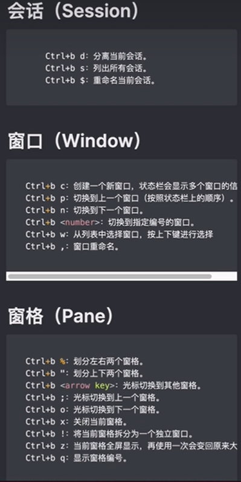

进入 `tmux` 
```
tmux                           创建默认名字的会话
tmux new -s mysession　　      创建名为mysession的会话
tmux attach -t mysession       进入会话 myssion  
tmux ls                        显示所有的会话
tmux a　　                     连接上一个会话
tmux a -t mysession　　        连接会话mysession
```

关闭会话
```
tmux rename -t s1 s2　　      重命名会话s1为s2
tmux kill-session　　         关闭上次打开的会话
tmux kill-session -t s1　　   关闭会话s1
tmux kill-session -a -t s1　　关闭除s1外的所有会话
tmux kill-server　　          关闭所有会话
```

